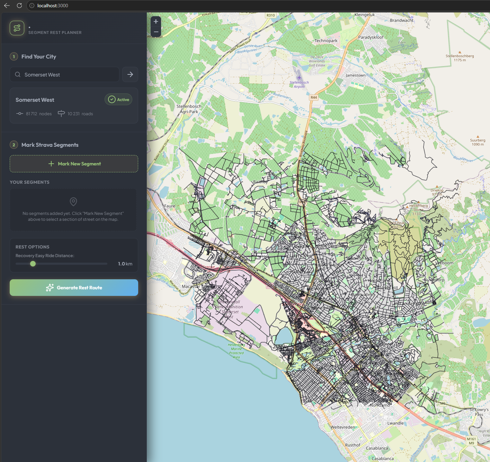
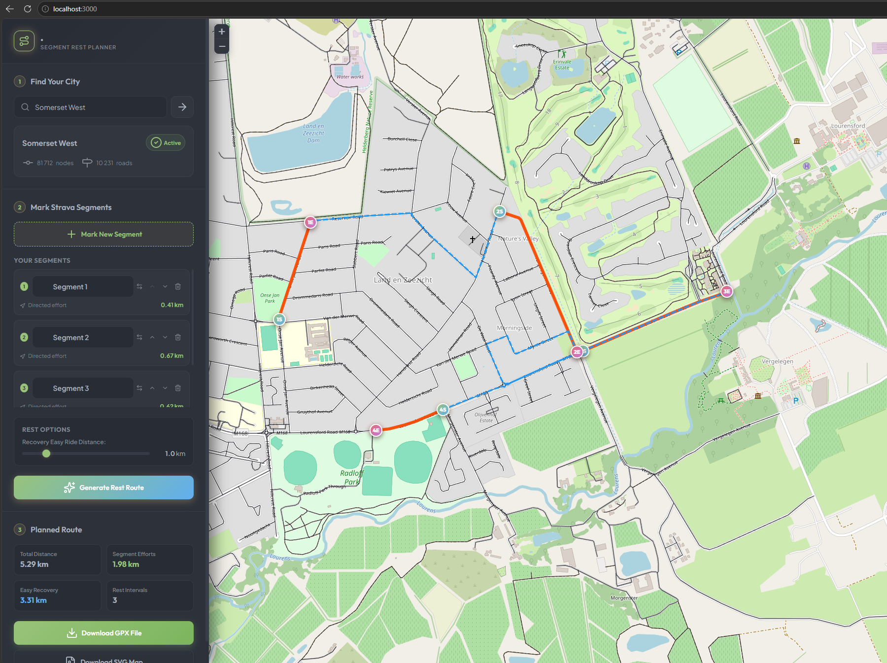

# Strava Segment Planner





## How it works

- **Select on the map the segments you want to cycle and set the distance you want to rest between each segment. The application will then calculate a route that covers all the selected segments in the specified order and will respect the segment direction.**

- **If two segments are closer to each other than the specified rest distance, the program will automatically choose a route that connects the two segments but is at least the specified rest distance apart.**

- **Click Generate Rest Route to generate the route. The application will then display the route on the map and will also provide a GPX file that you can download and use with your cycling computer.**

## Running the Application

1. **Install dependencies**:

   ```bash
   npm install
   ```

2. **Start the local server**:

   ```bash
   node server.js
   ```

3. Open your browser and navigate to `http://localhost:3000`.
